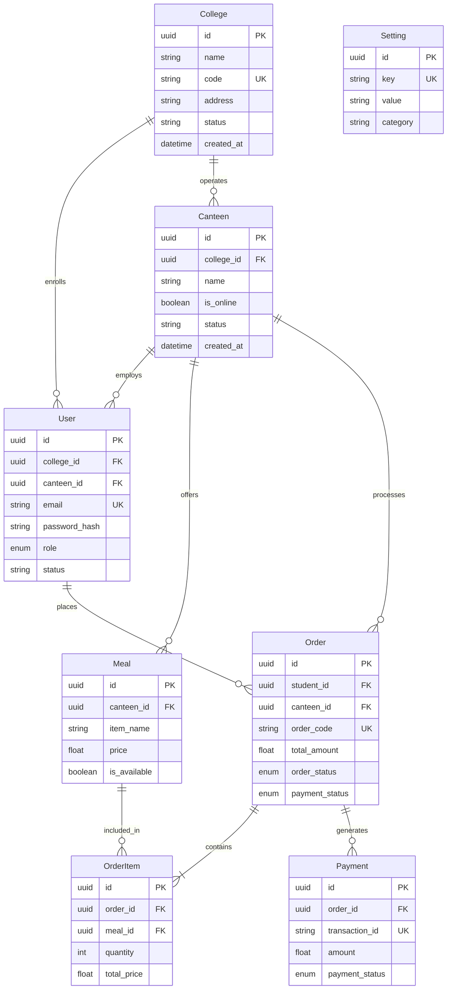

# Database ER Diagram & Schema Specification

```mermaid
erDiagram
    College ||--o{ User : enrolls
    College ||--o{ Canteen : operates
    Canteen ||--o{ User : employs
    Canteen ||--o{ Meal : offers
    Canteen ||--o{ Order : processes
    User ||--o{ Order : places
    Order ||--|{ OrderItem : contains
    Order ||--o{ Payment : generates
    Meal ||--o{ OrderItem : included_in

    College {
        uuid id PK
        string name
        string code UK
        string address
        string status
        datetime created_at
    }

    Canteen {
        uuid id PK
        uuid college_id FK
        string name
        boolean is_online
        string status
        datetime created_at
    }

    User {
        uuid id PK
        uuid college_id FK
        uuid canteen_id FK
        string email UK
        string password_hash
        enum role
        string status
    }

    Meal {
        uuid id PK
        uuid canteen_id FK
        string item_name
        float price
        boolean is_available
    }

    Order {
        uuid id PK
        uuid student_id FK
        uuid canteen_id FK
        string order_code UK
        float total_amount
        enum order_status
        enum payment_status
    }

    OrderItem {
        uuid id PK
        uuid order_id FK
        uuid meal_id FK
        int quantity
        float total_price
    }

    Payment {
        uuid id PK
        uuid order_id FK
        string transaction_id UK
        float amount
        enum payment_status
    }

    Setting {
        uuid id PK
        string key UK
        string value
        string category
    }
```
